# Urban Growth Monitoring from Aerial Imagery

Building segmentation with a U-Net, plus a full-image pipeline that counts buildings, measures built-up area
and draws a building-density heatmap. Trained and evaluated on the Massachusetts Buildings dataset.

| Predicted mask (1500x1500 aerial image) | Individual buildings (watershed) | Density heatmap |
|---|---|---|
| 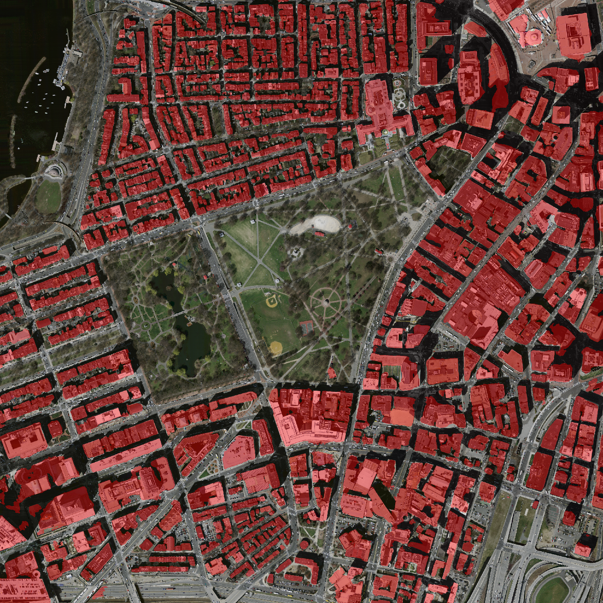 | 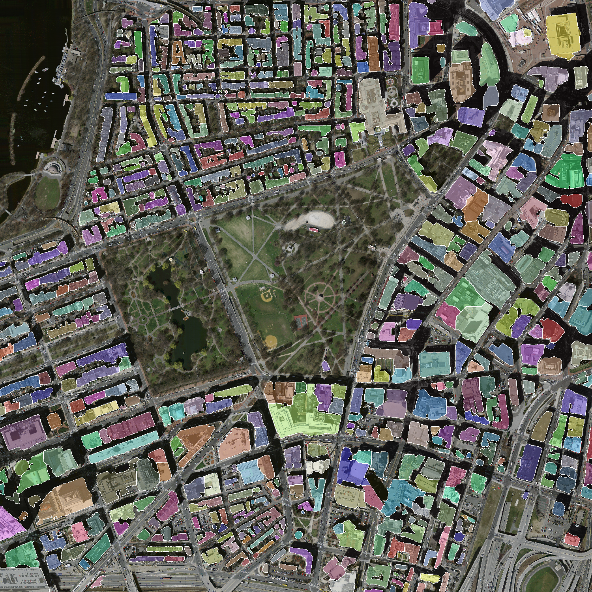 | 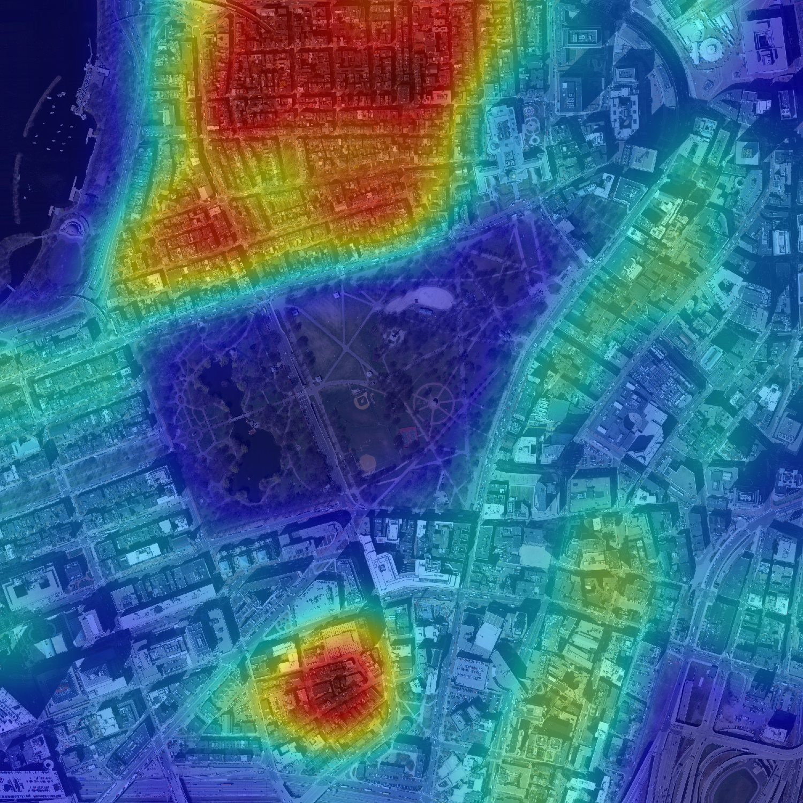 |

*Test image 23579005 (Boston Common): 34.8 % built-up area, 701 detected buildings (see the caveat on counts below).*

## Problem
Given an aerial image, find every building pixel, then turn the mask into numbers a planner can use: how many
buildings, what share of the area is built up, and where they cluster. Buildings are only ~5-35 % of pixels
(class imbalance) and touch each other, so plain pixel accuracy is misleading and a mask alone can't be counted.

## Dataset
[Massachusetts Buildings](https://www.kaggle.com/datasets/balraj98/massachusetts-buildings-dataset): 1500x1500 RGB
aerial images at ~1 m/pixel with binary building masks; 137 train / 4 val / 10 test images. Masks are 3-channel
PNGs with values {0, 255}, converted to 0/1. Training crops that are mostly white/black "no data" are skipped.

## Approach
| Choice | Why |
|---|---|
| **U-Net** | Encoder-decoder with skip connections: the encoder captures context, the skips restore the fine detail needed for building outlines. Works well with small datasets. |
| **ImageNet-pretrained ResNet34 encoder** | Only 137 training images. Pretrained edge/texture features transfer to aerial imagery and converge far faster than random init (val IoU 0.31 after epoch 1). |
| **Random 512x512 crops** | Full images don't fit a batch on a T4; crops are also augmentation (flips, 90-degree rotations, light colour jitter). |
| **BCE+Dice vs Focal+Dice** | Buildings are a minority class. Dice measures overlap directly (like the F1 score), so it counters the dominance of background pixels; BCE / Focal stabilises its gradients. Focal down-weights easy background pixels. |
| **IoU / Dice pooled over the whole set** | TP/FP/FN are summed over all pixels, then IoU and Dice are computed once. Averaging per batch is biased. |
| **Tiled inference with overlap + Gaussian blending** | The model expects 512 tiles. Tiles overlap by 128 px and are averaged with a weight that is ~0 at tile edges, so there are no seams (unit-tested: an identity "model" reconstructs the input exactly). |
| **Watershed on the distance transform** | Separates touching buildings: each building is a peak of the distance map, a narrow neck between two is a valley. h-maxima avoids splitting bumpy outlines. |

Training setup: AdamW (lr 3e-4, cosine decay), batch 8, 40 epochs x 400 random crops, mixed precision, seed 42,
about 20 minutes per experiment on a Kaggle GPU. The best checkpoint by validation IoU is evaluated once on the test split.

## Results

Test split (10 images). "Tiles" = the metric logged by `train.py` (512 tiles); "full" = whole 1500x1500 images through
the blended tiled inference (what a user actually gets).

| Experiment | Best val IoU | Test IoU (tiles) | Test Dice (tiles) | Test IoU (full) | Test Dice (full) |
|---|---|---|---|---|---|
| BCE + Dice | 0.6387 | 0.6914 | 0.8175 | **0.6950** | **0.8201** |
| Focal + Dice | 0.6398 | 0.6840 | 0.8124 | 0.6903 | 0.8168 |

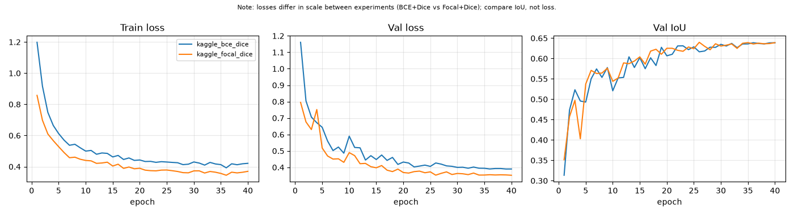

**Read this honestly:** BCE+Dice is ahead on test by ~0.005 IoU, while Focal+Dice is ahead on validation by ~0.001.
That is one seed per loss, 4 validation images and 10 test images, so **the two losses are effectively tied**; I
would not claim either is better without several seeds. (The two loss curves differ in scale because the losses are
different functions; compare IoU, not loss.) Per-image scores range from 0.64 to 0.75 IoU
(`docs/figures/per_image_*.csv`).

### Sample predictions (BCE + Dice, full test images)
Panels: image | ground truth | prediction | errors (green = correct, red = false alarm, blue = missed).

| | |
|---|---|
| 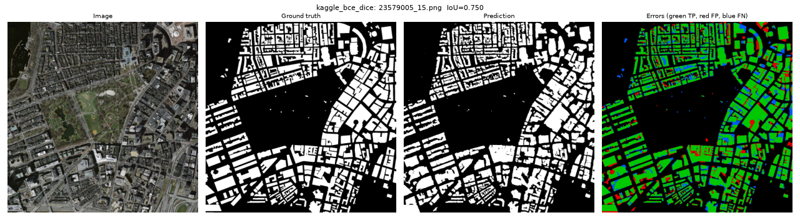 | 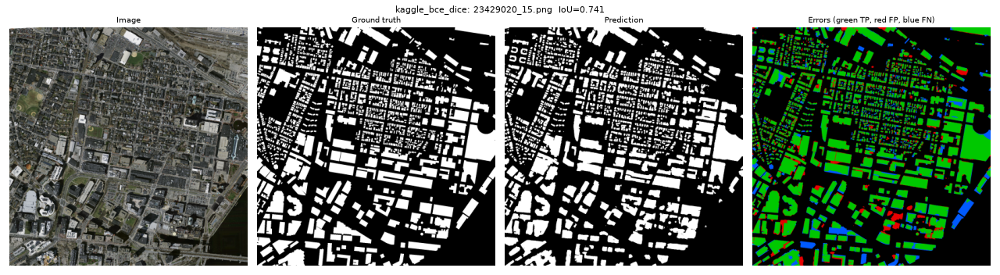 |
| 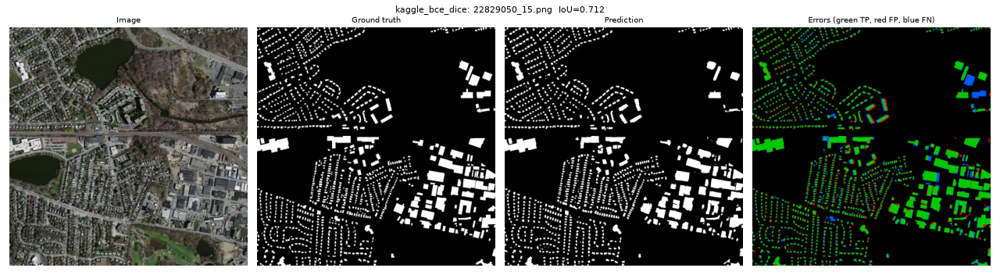 | 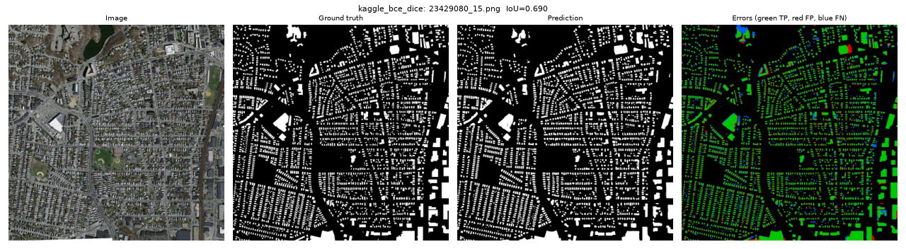 |
| 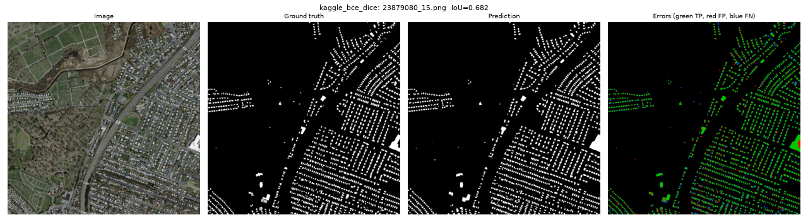 | 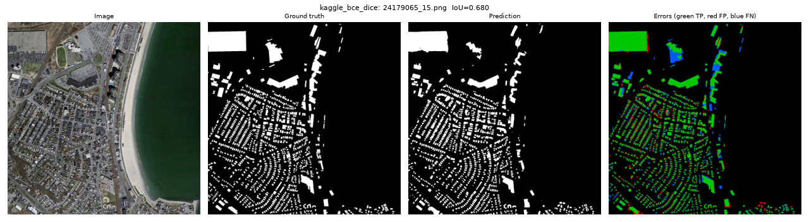 |

### Failure cases (the two lowest-IoU test images)
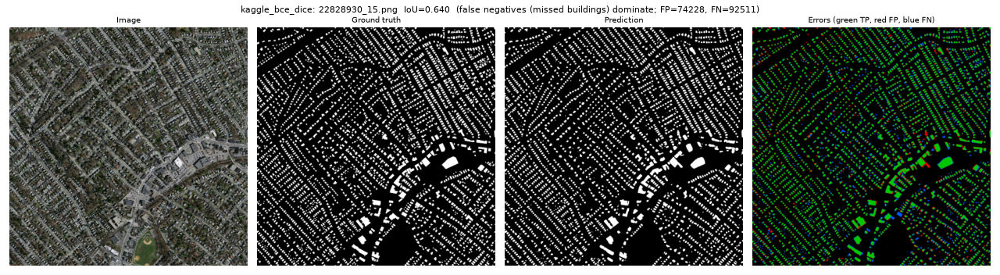
**22828930 (IoU 0.640):** very dense suburb with hundreds of tiny (~120 m2, ~10x12 px) houses, many partly under trees.
At 1 m/pixel a 1-pixel boundary shift on such small objects costs a lot of IoU, and houses hidden by canopy are missed.
The 2,657 "buildings" counted here is therefore only approximate.

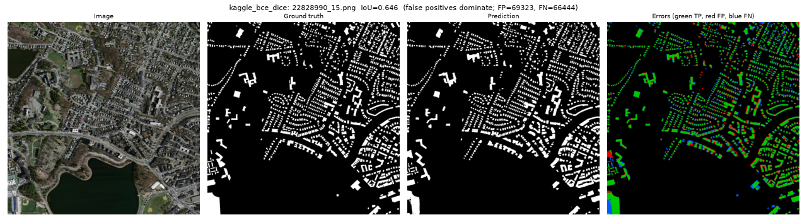
**22828990 (IoU 0.646):** large buildings at the left image border are partly missed, and thin red/blue outlines along
the rows of houses show boundaries offset by 1-2 px (partly label misalignment, partly the model). Roofs in shadow or
with unusual materials are the other typical miss.

### Known limitations
- **Building count is approximate:** watershed over-splits large complex roofs (e.g. big city blocks are cut into
  several pieces in the overlay above) and can under-split attached row houses. Count accuracy was **not** evaluated
  against ground-truth instances, only the mask was.
- One seed per experiment; no significance testing.
- The metric is IoU/Dice on pixels; boundary quality at 1 m/px limits the ceiling.
- Trained and tested on one region (Massachusetts); no cross-city evaluation yet.

## How to run

Setup (PowerShell, Python 3.10-3.12):
```powershell
python -m venv .venv; .\.venv\Scripts\Activate.ps1
pip install torch torchvision --index-url https://download.pytorch.org/whl/cpu   # CPU build; use the default index on a GPU machine
pip install -r requirements.txt
pytest                                                                          # 23 tests
```

**Local smoke test (CPU, ~1 min, uses 3 sample images in `data/sample/`):**
```powershell
python scripts/train.py --config configs/local.yaml --debug
python scripts/infer.py --config configs/local.yaml --debug
python app.py --config configs/local.yaml --debug
```

**Full training on Kaggle (GPU):** follow `notebooks/kaggle_run.md`, or push `kaggle_kernel/` with
`kaggle kernels push -p kaggle_kernel`. Then extract `results.zip` into `results/`.
Training resumes with `--resume` if a session stops.

**Inference on your own image / demo app:**
```powershell
python scripts/infer.py --config configs/local.yaml --image path\to\image.png
python app.py --config configs/local.yaml        # Gradio UI at http://127.0.0.1:7860
```
Checkpoints (~98 MB each) are not in git. `infer.checkpoint` in the config points at the trained `best.pth`;
if it is missing, the app falls back to the debug checkpoint and shows a warning.

**Report (table, curves, panels):** `python scripts/make_report.py --config configs/local.yaml --experiments kaggle_bce_dice kaggle_focal_dice`
(needs the 10 test pairs in `data/test/images` and `data/test/masks`).

## Project layout
```
configs/    YAML per experiment (paths and hyper-parameters, no hard-coding)
src/data/   datasets, crops, augmentation      src/losses/     BCE+Dice, Focal+Dice
src/models/ U-Net builder                       src/eval/       IoU/Dice, prediction panels
src/train/  epoch loop, helpers                 src/inference/  tiling, watershed, stats, heatmap
scripts/    train.py, infer.py, make_report.py  tests/          losses, metrics, tiling/stitching, watershed
results/    metrics.csv, config, test metrics, samples per experiment
docs/       learning_notes.md, interview_selfcheck.md, figures/
```

## Future work
- **SegFormer vs U-Net:** accuracy, parameter count and inference speed comparison.
- **Self-supervised pretraining** (SimCLR/MAE) on unlabelled patches, then fine-tune with 10 % of the labels.
- **Cross-city generalization** on Inria Aerial: train on some cities, test on a held-out one; colour augmentation and normalisation.
- **Change detection on LEVIR-CD:** before/after pairs, highlight new buildings and report growth statistics (the actual "urban growth" goal).
- **Better instance counting:** evaluate counts against ground-truth instances; try a learned boundary/instance head instead of watershed.
- **Uncertainty:** MC-dropout uncertainty map; multiple seeds to settle the loss comparison.
- **Deployment:** ONNX export + speed benchmark.

